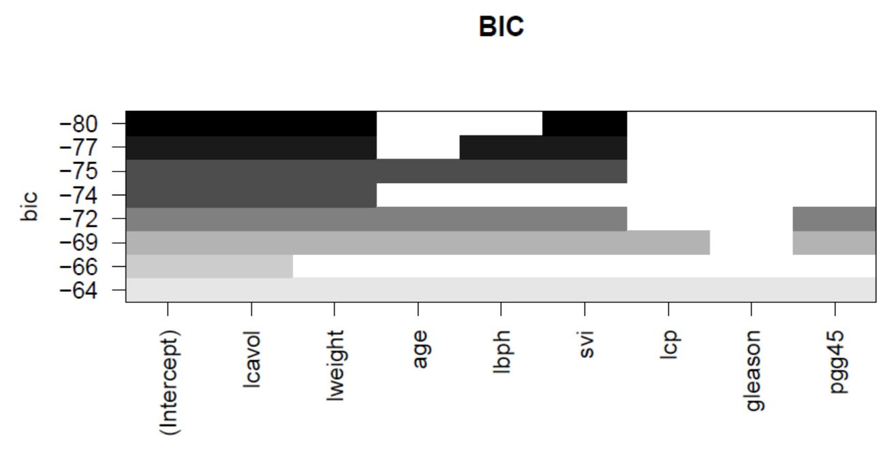
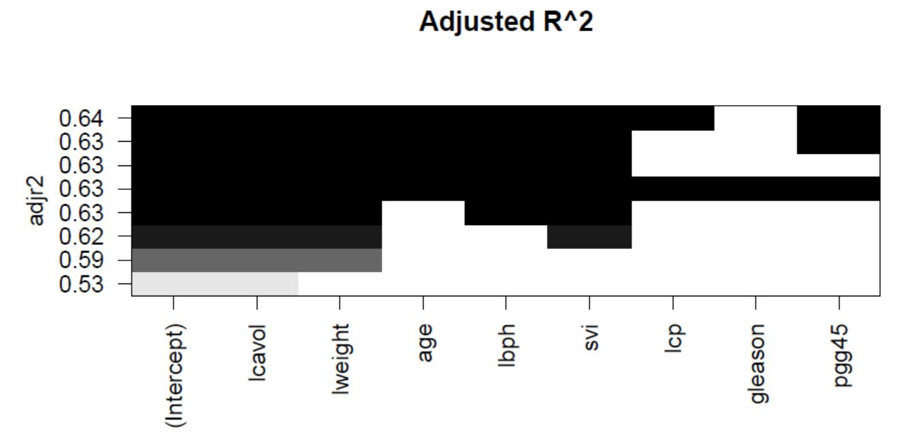

# Model Selection Approaches for Prostate Cancer Estimates
Several model selection strategies were implemented to find the best model fit to estimate prostate cancer. The prostate cancer data come from a study that examined the correlation between the level of prostate specific antigen and a number of clinical measures in men who were about to receive a radical prostatectomy. It is data frame with 97 rows and 9 columns. The data variables are as follows:

- lcavol: log(cancer volume)
- lweight: log(prostate weight)
- age: age of the patient
- lbph: log(benign prostatic hyperplasia amount)
- svi: seminal vesicle invasion
- lcp: log(capsular penetration)
- gleason: Gleason score
- pgg45: percentage Gleason scores 4 or 5
- lpsa: log(prostate specific antigen)

To combat overfitting, we usually look for the best model fit subject to a constraint on model complexity. So, we choose a model that has reasonable predictive power, but is not too complicated (i.e. not too many predictors). There are a large number of model selection methods, based on different criteria. We will examine the most common ones, namely, exhaustive search, forward selection, and backward selection. Furthermore, the focused criteria will be Akaike Information Criterion (AIC), Bayesian Information Criterion (BIC), and Adjusted R^2.

## Best subset strategy (exhaustive search)

